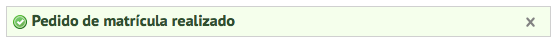

.. _enrollment:

Matrícula
=========

Neste tutorial apresentamos o módulo de Matricula e as seguintes funcionalidades:

- `Informações gerais`_
- `Acesso à matrícula`_
- `Solicitar matrícula em uma oferta`_
- `Cancelar matrícula em uma Unidade Curricular`_

.. _enrollment-info:

Informações gerais
------------------

Após efetuar o devido Login no Solar 2.0, nos deparamos com o Home, página inicial do AVA.

- Ao solicitar matrícula, o usuário estará solicitando que um perfil do tipo Aluno seja associado a ele para determinada disciplina.
- Um perfil está associado a um conjunto de permissões que o usuário tem para realizar atividades no Solar 2.0.
- Ao realizar a matrícula, o usuário deve aguardar o aceite dessa para que possa estar devidamente matriculado na disciplina desejada.
- O Aceite de Matrícula é necessário para que um aluno possa cursar uma disciplina no Solar 2.0, exceto para as disciplinas dos cursos oferecidos pela UAB, pois a matricula destes é realizada pelo Módulo Acadêmico.

.. _enrollment-access:

Acesso à matrícula
------------------

Ao acessar a tela de matrícula, o usuário se depara com quatro áreas. A primeira é a área de Busca, na qual o usuário pode buscar pelo nome da disciplina, primeiro campo de busca, ou por seu tipo, segundo campo de busca. 

Ressaltamos que Disciplinas, no contexto do Solar 2.0, possuem os tipos:

- Curso de extensão;
- Curso de Graduação a distância;
- Curso de Graduação presencial;
- Curso de Pós-graduação a distância;
- Curso de Pós-graduação presencial;
- Curso Livre.

Para realizar uma busca, o usuário deve preencher ao menos um dos dois campos e clicar no botão de **lupa**   para realizar a busca

.. image:: images/enrollment-search.png

A segunda área é uma lista de todas as disciplinas nas quais o usuário já está matriculado. Sendo que este pode, ou não, cancelar sua matrícula.

A terceira área é uma lista com todas as matrículas pendentes realizadas pelo usuário. Ou seja, todos os pedidos de matrícula que ainda não foram aceitos.

A quarta e última área é uma lista com todas as ofertas correntes (ou seja, cujo período de matrícula ainda está vigente) de disciplinas disponíveis para matrícula no sistema. O botão de informações abrirá a janela abaixo, que contém todas as informações disponíveis da oferta como detalhes da disciplina, período de vigência, período de matrícula e os responsáveis (professores, tutores etc) pela disciplina.

.. _enrollment-request:

Solicitar matrícula em uma oferta
---------------------------------

Para solicitar sua matrícula em alguma oferta de disciplina disponível, basta clicar em **Matricular**.

Ao clicar no botão informado, a seguinte mensagem de sucesso aparecerá.

.. _enrollment-cancel:

Cancelar matrícula em uma Unidade Curricular
--------------------------------------------

Para cancelar a matricula de Unidade Curricular, basta clicar no botão **Cancelar pedido**.

Será enviada uma mensagem de confirmação em seguida.

.. image:: images/enrollment-cancel-02.png