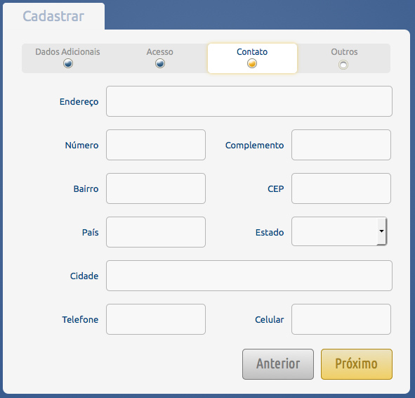
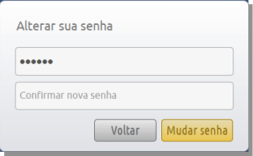

.. _access:

Acesso ao Ambiente
==================

Cras justo odio, dapibus ac facilisis in, egestas eget quam. Praesent commodo cursus magna, vel scelerisque nisl consectetur et. 

.. _login:

Login
-----

Caso o usuário já possua uma Login e senha cadastrada, basta inserir estes dados e clicar em *Acessar*. A próxima página apresentada será a Home do sistema. 

.. _cadastro:

Cadastro
--------

Para se cadastrar basta clicar em *Cadastrar*. Na tela seguinte será solicitado o e-mail e o CPF do usuário.

1. Inserir um CPF válido

.. image:: images/cadastro-01.png

2. Inserir dados pessoais

.. image:: images/cadastro-02.png

3. Inserir dados de acesso

.. image:: images/cadastro-03.png

4. Inserir dados de contato

5. Informar a instituição na qual você pertence

.. image:: images/cadastro-05.png

Depois de concluído o cadastro o usuário já pode entrar no sistema normalmente. 

.. _recuperar_senha:

Recuperar Senha
---------------

Caso já tenha um usuário, mas perdeu a senha, basta clicar em *Esqueceu a sua senha?* na tela de Login. Na próxima tela será solicitado o e-mail que você informou ao criar seu usuário.

.. image:: images/password-01.png

Será enviada uma mensagem de confirmação para o endereço de e-mail informado.

.. image:: images/password-02.png

Após clicar no link informado no email, será solicitada uma nova senha.

.. _sair_sistema:

Saindo do sistema
-----------------

Para sair do sistema basta clicar em *Sair*, na barra superior.

.. image:: images/logout-01.png

Após sair do sistema, será apresentada a mensagem *Logout efetuado com sucesso* na página de login.

