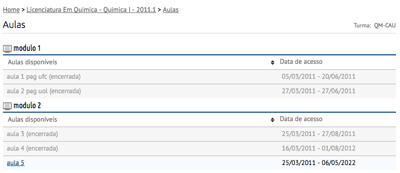
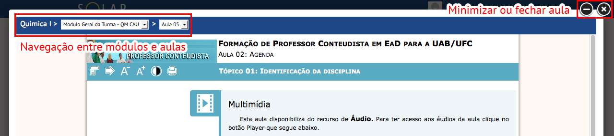
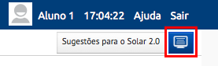

Aulas
=====

Neste item estarão dispostas as aulas da Unidade Curricular escolhida, informando nome e o período em que ela estará disponível.

.. note:: Caso a aula possua uma data final, então seu acesso será bloqueado após esta data.

Para acessar uma aula basta clicar sobre ela. Uma janela será apresentada e nela teremos a exibição da aula, e uma barra lhe permitindo a:

- navegar entre as aulas disponíveis;
- minimizar a aula e navegar no ambiente sem perder a posição atual;
- fechar a aula.

Ao minimizar uma aula, para restaurá-la basta clicar sobre o botão |btn_lesson_restore| (*Exibir aula aberta*).

.. imagens inline
